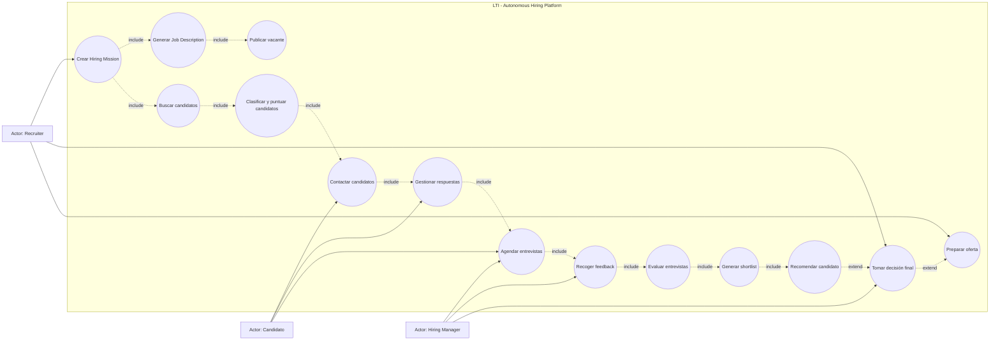
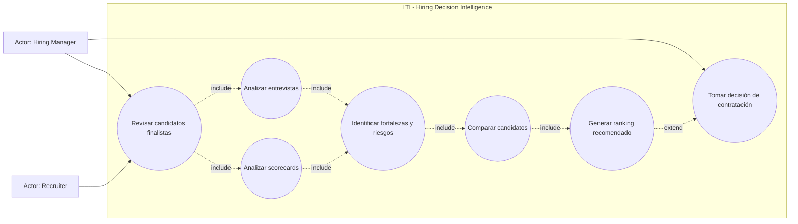
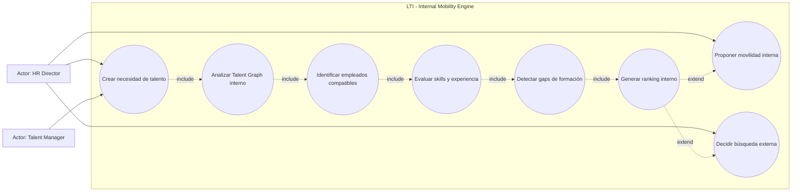
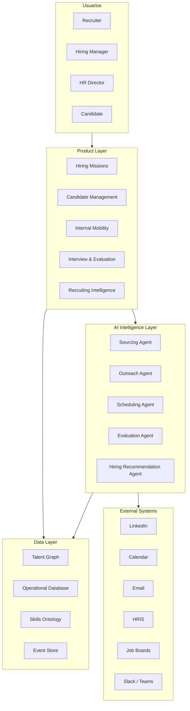
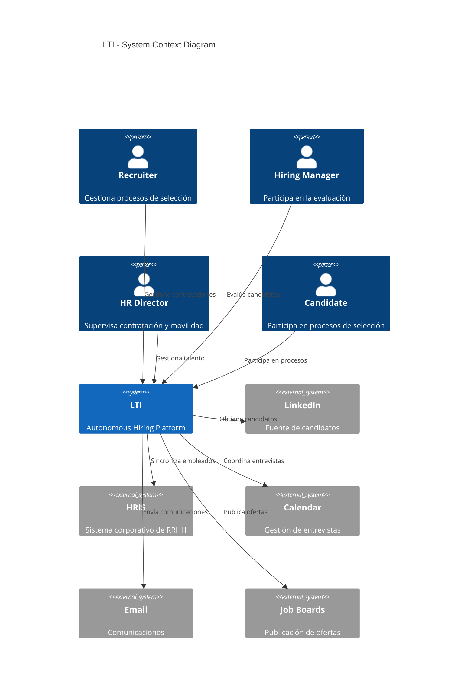
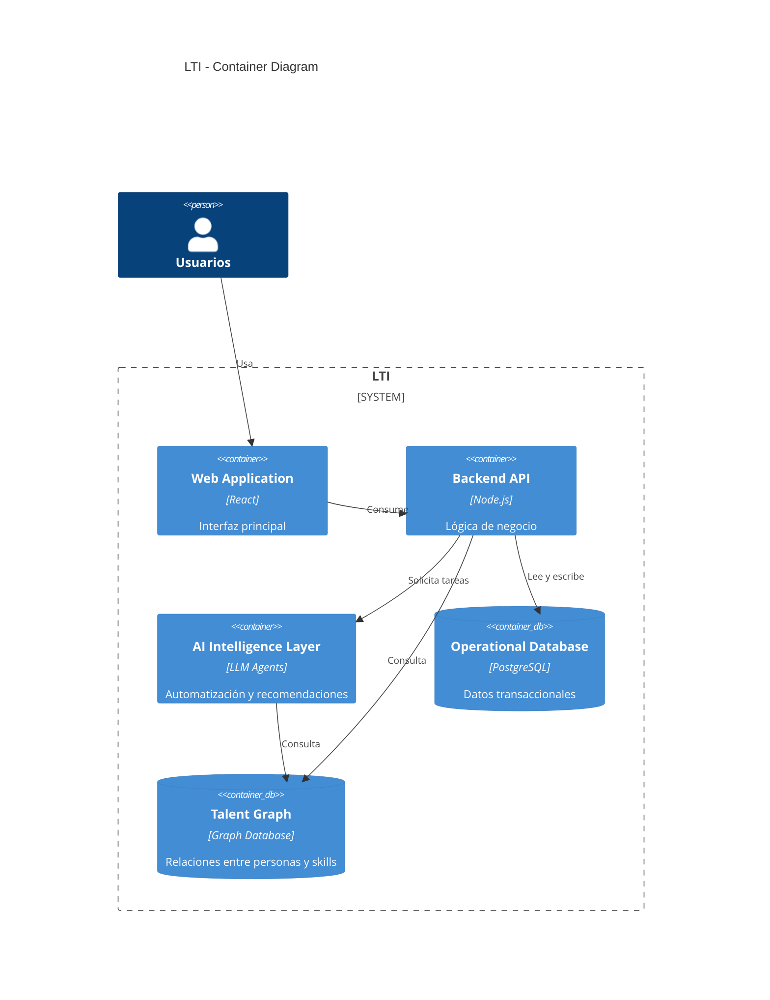
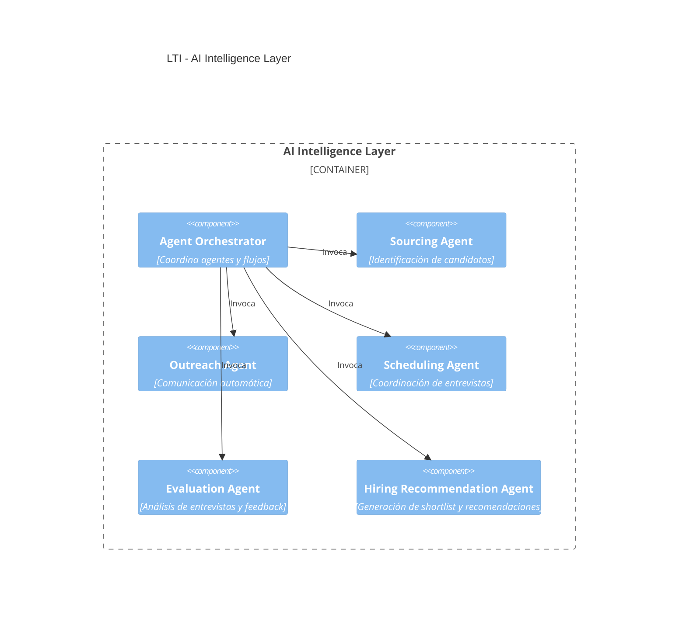

# LTI - Diseño inicial del sistema ATS

1. Introducción
2. Funcionalidades principales
3. Lean Canvas
4. Casos de uso principales
5. Modelo de datos
6. Diseño de sistema de alto nivel
7. Diagrama C4 - Profundización en el módulo de evaluación IA

# LTI - Diseño inicial del sistema ATS

## 1. Introducción

LTI es una plataforma ATS moderna diseñada para ayudar a equipos de Recursos Humanos, reclutadores y hiring managers a gestionar procesos de selección de forma más eficiente, colaborativa y basada en datos.

El sistema permite centralizar ofertas de empleo, candidaturas, evaluaciones, entrevistas, comunicaciones y decisiones de contratación en una única herramienta. Su principal diferenciador frente a un ATS tradicional es la incorporación de asistencia mediante inteligencia artificial para reducir tareas repetitivas, mejorar la calidad del filtrado inicial y facilitar la toma de decisiones durante todo el proceso.

LTI busca resolver problemas habituales en selección de talento: exceso de trabajo manual, pérdida de información entre equipos, falta de trazabilidad, comunicación dispersa y dificultad para comparar candidatos de forma objetiva.

## 2. Explicación de las funciones principales

Las funciones principales de LTI cubren el ciclo completo de contratación, desde la definición de la necesidad de talento hasta la evaluación, decisión final y movilidad interna, incorporando IA para reducir tareas manuales y mejorar la calidad del proceso.

- **Hiring Mission Management:** Permite definir necesidades de contratación como objetivos de negocio, incluyendo rol, skills, seniority, ubicación, plazos y prioridades.

- **Talent Graph:** Construye un mapa inteligente de personas, skills, roles y experiencias para mejorar el matching entre candidatos, empleados y vacantes.

- **Candidate Intelligence Engine:** Enriquece los perfiles de candidatos mediante IA, analizando CVs, experiencia, skills, seniority, encaje con el puesto y probabilidad de aceptación.

- **AI Recruiting Agents:** Automatiza tareas operativas mediante agentes especializados en sourcing, comunicación con candidatos, coordinación de entrevistas, evaluación y recomendaciones.

- **Collaborative Hiring Workspace:** Facilita la colaboración entre recruiters y hiring managers mediante resúmenes, scorecards, comparativas y feedback estructurado.

- **Candidate Experience Platform:** Mejora la experiencia del candidato ofreciendo seguimiento del proceso, comunicación automatizada, agenda de entrevistas y soporte mediante IA.

- **Recruiting Intelligence:** Proporciona analítica y predicciones sobre métricas clave como time-to-hire, calidad de fuentes, productividad del recruiter y probabilidad de éxito de contratación.

- **Internal Mobility Engine:** Identifica empleados internos que podrían encajar en nuevas posiciones, detectando gaps de skills y oportunidades de promoción o desarrollo.

## 3. Lean Canvas

```mermaid
flowchart TB

    subgraph PROBLEMAS["🔴 Problemas"]
        P1["Mucha carga administrativa"]
        P2["ATS = Sistema de registro"]
        P3["Poca colaboración de Hiring Managers"]
        P4["Procesos lentos y mala experiencia candidato"]
        P5["Falta de inteligencia predictiva"]
    end

    subgraph SOLUCION["🟢 Solución"]
        S1["AI Recruiting Agents"]
        S2["Talent Graph"]
        S3["Hiring Intelligence"]
        S4["Internal Mobility Engine"]
        S5["Candidate Experience Platform"]
    end

    subgraph UVP["⭐ Propuesta de Valor Única"]
        UV["La primera plataforma de Autonomous Hiring que ejecuta el trabajo operativo del recruiting mediante IA para que recruiters y managers se centren únicamente en tomar decisiones."]
    end

    subgraph CLIENTES["👥 Segmentos de Clientes"]
        C1["Empresas 100-5.000 empleados"]
        C2["Talent Acquisition Teams"]
        C3["HR Leaders"]
        C4["Recruitment Operations"]
        C5["Empresas con alto volumen de contratación"]
    end

    subgraph CANALES["📢 Canales"]
        CH1["Venta directa SaaS"]
        CH2["Partners HR Tech"]
        CH3["Integraciones ATS/HRIS"]
        CH4["Content Marketing"]
        CH5["Eventos HR & Talent Tech"]
    end

    subgraph VENTAJA["🚀 Ventaja Competitiva"]
        U1["Talent Graph propietario"]
        U2["Arquitectura AI-Native"]
        U3["Recruiting Agents autónomos"]
        U4["Knowledge Graph de talento"]
        U5["Efecto red de contratación"]
    end

    subgraph METRICAS["📊 Métricas Clave"]
        M1["Time-to-Hire"]
        M2["Cost-per-Hire"]
        M3["Recruiter Productivity"]
        M4["% Automatización"]
        M5["Candidate NPS"]
        M6["Offer Acceptance Rate"]
    end

    subgraph INGRESOS["💰 Fuentes de Ingresos"]
        R1["Suscripción SaaS"]
        R2["Licencias por Recruiter"]
        R3["Módulos IA Premium"]
        R4["Talent Intelligence"]
        R5["Usage-Based AI Agents"]
    end

    subgraph COSTES["💸 Estructura de Costes"]
        K1["Cloud Infrastructure"]
        K2["LLMs & IA"]
        K3["Desarrollo Producto"]
        K4["Data Engineering"]
        K5["Ventas & Customer Success"]
        K6["Integraciones"]
    end

    PROBLEMAS --> SOLUCION
    SOLUCION --> UVP
    UVP --> CLIENTES

    CLIENTES --> CANALES
    UVP --> VENTAJA

    VENTAJA --> METRICAS
    METRICAS --> INGRESOS

    INGRESOS --> COSTES
```


## 4. Principales casos de uso
### Caso de Uso 1: Autonomous Hiring

#### Objetivo

Cubrir una vacante con la mínima intervención manual posible.

#### Actor Principal

Recruiter

#### Flujo

1. El recruiter crea una Hiring Mission.
2. LTI genera automáticamente la descripción del puesto.
3. LTI identifica y clasifica candidatos potenciales.
4. El Outreach Agent contacta a los candidatos.
5. El Scheduling Agent coordina entrevistas.
6. El Evaluation Agent resume entrevistas y feedback.
7. El Hiring Agent genera una shortlist final.
8. El recruiter toma la decisión final.

#### Beneficios

- Reducción de tareas manuales.
- Menor Time-to-Hire.
- Mayor productividad del recruiter.
- Mayor volumen de candidatos gestionados.



---

### Caso de Uso 2: AI-Assisted Hiring Decision

#### Objetivo

Facilitar la toma de decisiones de contratación mediante inteligencia artificial.

#### Actor Principal

Hiring Manager

#### Flujo

1. Los candidatos completan el proceso de evaluación.
2. LTI analiza entrevistas, scorecards y feedback.
3. Se genera un resumen ejecutivo por candidato.
4. LTI identifica fortalezas, debilidades y riesgos.
5. Se crea una comparativa entre finalistas.
6. LTI propone un ranking de candidatos.
7. El Hiring Manager toma la decisión final.

#### Beneficios

- Decisiones más rápidas.
- Menor sesgo en la evaluación.
- Comparaciones objetivas.
- Mayor calidad de contratación.

---

### Caso de Uso 3: Internal Talent Discovery

#### Objetivo

Identificar talento interno antes de iniciar una búsqueda externa.

#### Actor Principal

HR Director / Talent Manager

#### Flujo

1. Se crea una nueva necesidad de contratación.
2. LTI analiza el Talent Graph corporativo.
3. Se identifican empleados con skills compatibles.
4. LTI evalúa experiencia, potencial y desempeño.
5. Se detectan gaps de conocimiento.
6. Se propone un ranking de candidatos internos.
7. Se generan recomendaciones de desarrollo o promoción.
8. La organización decide cubrir la posición internamente o iniciar un proceso externo.

#### Beneficios

- Reducción de costes de contratación.
- Mayor retención de talento.
- Incremento de movilidad interna.
- Aprovechamiento del conocimiento organizacional.




## 5. Modelo de datos

```mermaid
classDiagram

class User {
  id: UUID
  name: String
}

class Recruiter {
  id: UUID
}

class HiringManager {
  id: UUID
}

class Candidate {
  id: UUID
  fullName: String
}

class Employee {
  id: UUID
  fullName: String
}

class HiringMission {
  id: UUID
  title: String
}

class Position {
  id: UUID
  title: String
}

class Skill {
  id: UUID
  name: String
}

class TalentPool {
  id: UUID
  name: String
}

class Application {
  id: UUID
  status: String
}

class Interview {
  id: UUID
  date: DateTime
}

class Evaluation {
  id: UUID
  score: Integer
}

class Offer {
  id: UUID
  status: String
}

class AIAgent {
  id: UUID
  name: String
}

class TalentRecommendation {
  id: UUID
  type: String
}

User <|-- Recruiter
User <|-- HiringManager

HiringMission "1" --> "1" Position
HiringMission "1" --> "*" Application

Candidate "1" --> "*" Application

Candidate "*" -- "*" Skill
Employee "*" -- "*" Skill

TalentPool "*" -- "*" Candidate

Application "1" --> "*" Interview

Interview "1" --> "*" Evaluation

HiringManager "1" --> "*" Evaluation

Application "1" --> "0..1" Offer

AIAgent "*" --> "*" HiringMission

Employee "1" --> "*" TalentRecommendation

Position "*" -- "*" Skill

TalentRecommendation "*" --> "1" Position
TalentRecommendation "*" --> "1" Employee
```


# 6. Diseño a alto nivel
## LTI - Diseño de Alto Nivel

### Visión

LTI es una plataforma de **Autonomous Hiring** que combina ATS, Talent Intelligence y AI Agents para automatizar el proceso de contratación de extremo a extremo.

Su objetivo es reducir el trabajo operativo de recruiters y hiring managers para que puedan centrarse en la toma de decisiones.

## Principios de Diseño

LTI sigue un enfoque **AI-First**, donde la inteligencia artificial forma parte del núcleo de la plataforma y no se incorpora como una funcionalidad adicional. Los agentes de IA automatizan tareas operativas como la búsqueda de candidatos, la comunicación, la coordinación de entrevistas y la generación de recomendaciones, permitiendo que recruiters y hiring managers se centren en la toma de decisiones. 

Toda la inteligencia del sistema se construye sobre un **Talent Graph**, un modelo que relaciona personas, skills, roles y experiencias para ofrecer una visión más completa del talento y habilitar capacidades avanzadas de búsqueda, matching y recomendación.

A pesar del alto nivel de automatización, LTI mantiene un enfoque **Human-in-the-Loop**, donde las decisiones estratégicas y de contratación continúan bajo control humano, mientras la IA actúa como asistente y ejecutor. Además, la plataforma está diseñada para ser **extensible y evolutiva**, permitiendo incorporar nuevos agentes, integraciones y capacidades sin necesidad de rediseñar la arquitectura principal.

---

## Objetivo

```text
System of Record
        ↓
System of Intelligence
        ↓
System of Autonomous Hiring
```

LTI evoluciona el ATS tradicional hacia una plataforma capaz de ejecutar y optimizar procesos de contratación de forma autónoma.

---

## Arquitectura

LTI se organiza en cinco capas:

### Usuarios

* Recruiter
* Hiring Manager
* HR Director
* Candidate

### Product Layer

* Hiring Missions
* Candidate Management
* Internal Mobility
* Interview & Evaluation
* Recruiting Intelligence

### AI Intelligence Layer

* Sourcing Agent
* Outreach Agent
* Scheduling Agent
* Evaluation Agent
* Hiring Recommendation Agent

### Data Layer

* Talent Graph
* Operational Database
* Skills Ontology
* Event Store

### Integraciones

* LinkedIn
* Job Boards
* Email
* Calendar
* HRIS
* Slack / Teams

---

## Diagrama de Arquitectura




# 7. Diagrama C4: Ai Intelligence Layer

# Diagrama C4 - LTI

# C4 Model - LTI

Para describir la arquitectura de LTI se utiliza el modelo C4, que permite representar el sistema en distintos niveles de detalle. Se presentan tres diagramas: Context, Container y Component. El nivel de mayor profundidad se centra en la **AI Intelligence Layer**, ya que constituye el elemento diferenciador de la plataforma y concentra la lógica de automatización del proceso de contratación.

---

# Nivel 1 - System Context Diagram

Este diagrama muestra LTI como un único sistema y cómo interactúa con los actores principales y con los sistemas externos del ecosistema de recruiting.



---

# Nivel 2 - Container Diagram

Este nivel muestra los principales contenedores que forman la plataforma y sus relaciones.



---

# Nivel 3 - Component Diagram

Este nivel profundiza en la **AI Intelligence Layer**, responsable de automatizar tareas operativas y generar recomendaciones para recruiters y hiring managers.



---

# Justificación

El modelo C4 permite visualizar progresivamente la arquitectura de LTI, desde la interacción con usuarios y sistemas externos hasta el detalle interno de uno de sus componentes más importantes. La elección de la **AI Intelligence Layer** como nivel de profundización se debe a que concentra la propuesta de valor diferencial de la plataforma mediante agentes especializados capaces de automatizar tareas como el sourcing, la comunicación con candidatos, la coordinación de entrevistas, el análisis de feedback y la generación de recomendaciones de contratación.
